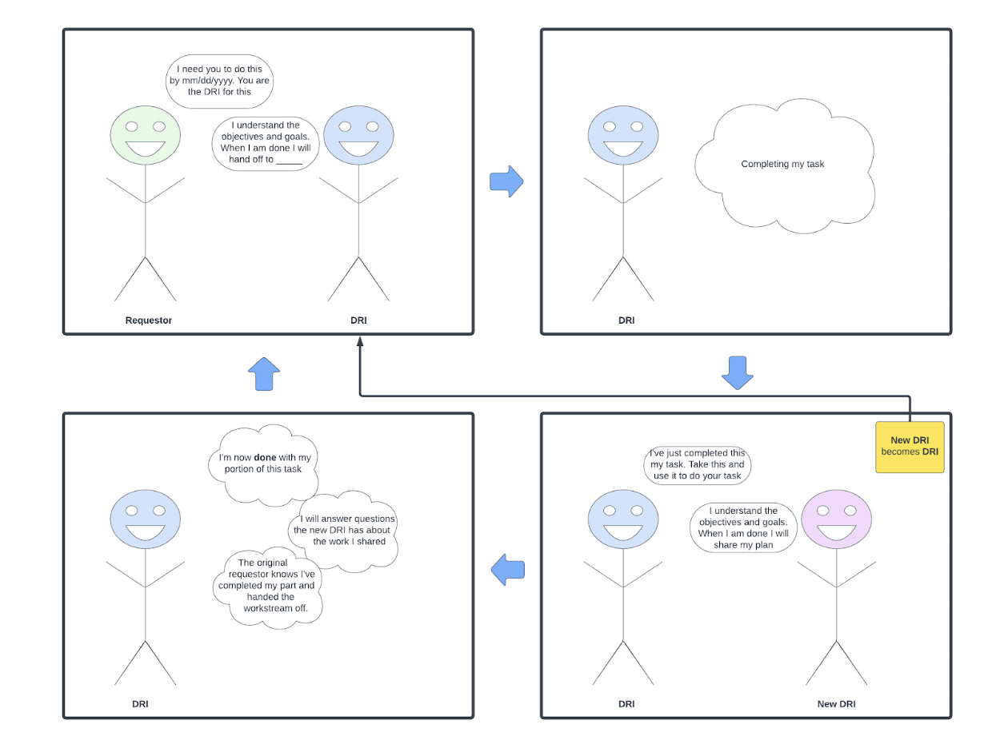

As the DRI for a Workstream (WSX), the responsibilities include:

Ownership mindset → 
Make sure you are clear on what it is you own. Questions to consider:
Am I clear on the objectives and goals of what I’m being asked to do?
Is there a clear deadline?
What are the expectations when I am complete? (e.g. Who do I hand this off to? Do I need to do anything to move this to the next stage?)
Follow progress toward goals closely every week, and ensure the right things are being worked on with high quality. 
If we are behind on goal, the DRI will jam with the xfn team to get back on track asap
Own completion and handoff:
After the task is completed, it is the DRI’s responsibility to move this initiative to the next stage. This may involve:
An explicit handoff to the next DRI
Share your expectations for what the new DRI will do
New DRI explicitly accepting this handoff

Decision making → 
Unblock teams, and ensure projects are moving forward. 
Escalate issues and raise risks early.

Central point of communication → 
Knows what’s happening on all projects in the workstream with enough fidelity to field questions and communicate upward and with other leads if things require unblocking. 
Ensure execution report and project status is up to date.

Collaborate with XFN partner → 
Ensure we are solving the right Cx first problem. 
Ensure that priorities for the workstream align with the strategy. Adjust overall roadmap and backlog, reprioritizing as needed. 
Ensure projects have proper goals, right measurements, and clear lifecycle ownership.

Provide technical supervision → 
Ensure engineering design quality and consistency through design review and process building.
Accountable for consistency in technical strategy and for communication of it. Expected to work with constituent workstream members in creation of technical strategies.
Decide what tools we need to build.

This person is NOT expected to execute on all projects needed to hit the goal for the workstream.

